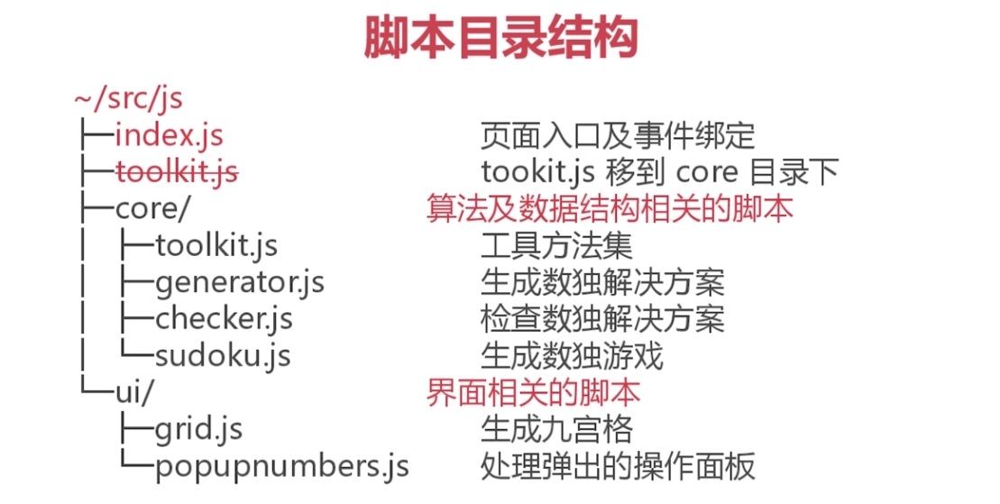

# 数独游戏

> 慕课网教程，使用构建工具和web技术编写的一个数独游戏

## 采用技术
- H5 LESSS/CSS
- JS、JQ
- Typescript 2.0+

## 前端构建技术
- Node.js 6+ /Yarn
- Gulp、webpack、Babel
- TSC(Typescript Compiler)

## 数据结构 - 数组

第一维：行，9个数组组成，每行是第二层数组

第二维：格，9个数组成

## 游戏算法

递归

菜用一个简单的算法，从数字1开始

失败重算

随机位置，Fisher-Yates洗牌算法

**检查算法** ———— 行、列、宫

**数据抽取** ———— array as result
- 抽取行数据，直接获取
- 抽取列数据，二维映射
- **抽取宫数据** —— 寻找关系

